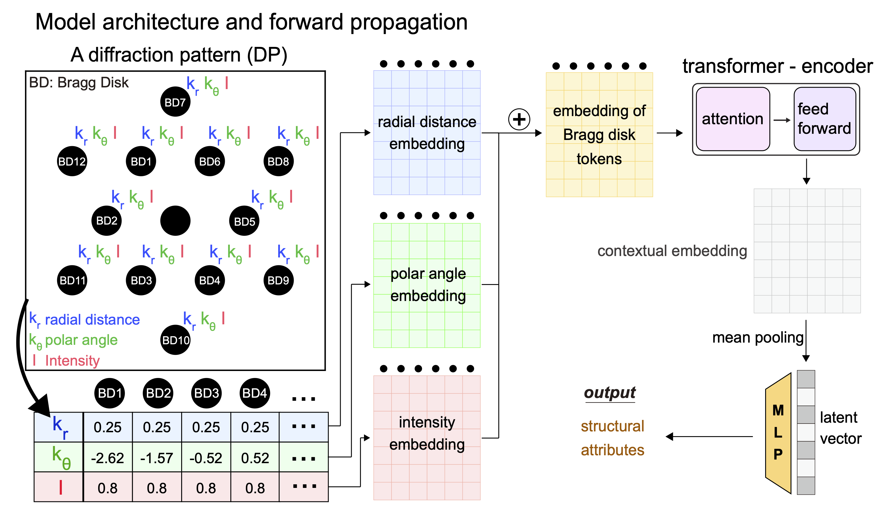

# microstructureInference

A package designed to train a model for identifying structural attributes (crystallographic orientations and phases) of a single crystal from 4-dimensional scanning transmission electron microscopy (4D-STEM) diffraction patterns.



We have made modifications and additions to the original py4DSTEM codebase to support simulations of dynamic diffraction from SO3 proper orientation matrix and to support calculation of sparse correlation value between two Bragg vector point list.

## License Notice
- Licensed under the GNU General Public License v3.0
- Modified version of py4DSTEM codes are in "third_party" directory
- The original py4DSTEM project is available at: https://github.com/py4dstem/py4DSTEM

## How to install source codes
##### First install project dependencies from pyproject.toml
```bash
python -m pip install .
```
##### Then install torch>=2.8.0 and torchvision>=0.23.0 with CUDA build.

###### (optional) you can run the following command to install torch, torchvision, and cuda build
```bash
pip install -r requirements-cuda.txt
```

---

### Crystal Structures Used
The unit cell cif files used in this study are based on entries from the Inorganic Crystal Structure Database (ICSD) (https://icsd.products.fiz-karlsruhe.de/):

| ICSD collection code | Chemical formula | crystal space group | crystal space group IT number | variable string used in codes |
|:--------------------:|:----------------:|:-------------------:|:-----------------------------:|:-----------------------------:|
| ICSD #136042         |    Cu            |     F m -3 m        |            225                |           'Cu_fcc'            |
| ICSD #63281          | Cu<sub>2</sub>O  |     P n -3 m Z      |            224                |           'Cu2O_cubic'        |


Due to licensing restrictions, cif files are not included. Users with access to the ICSD can retrieve the data via these entry numbers.
If you don't have access to the ICSD, you can get unit cell information and cif files from other open-source projects including
materials project (https://next-gen.materialsproject.org/).

---

### How to load modified py4DSTEM library in "third_party" directory in a python script.

###### Set absolute path of "third_party" directory
```bash
import os
import sys
third_party_path = os.path.abspath("/path/towards/third_party/")
```
###### Then, add searchpath via sys.path
```bash
sys.path.insert(0, third_party_path)
```

###### Now, you can load py4DSTEM library in "third_party" directory.
```bash
import py4DSTEM
```

---

### Descriptions for training neural networks models

#### How to generate synthetic training data for training neural network models

##### To train the model, you would need synthetic training and validation data, which are simulated diffraction pattern (table of Bragg disks) with orientation labels. 

##### The "./scripts/training_and_validation_data_generation" directory contains scripts for generating synthetic training and validation data

###### step 01. We first sample thickness and orientations from given crystal unit cell.
###### step 02. From the sampled orientations and thickness, we simulate dynamic diffraction patterns and save them in table format.
###### step 03. For each diffraction pattern, we further digitize Bragg disk positions and intensities (still in table format)
###### step 04. Finally, we merge all data and split it into training data and validation data

#### Model training

###### Once training/validation datasets are prepared you can train model.

##### The "./scripts/train_transformer/orientation_prediction" directory contains scripts for training a model for orientation prediction
##### The "./scripts/train_transformer/joint_phase_and_orientation_prediction" directory contains scripts for training a model for joint prediction of orientations and phases


#### Analysis codes

###### Analaysis codes are included in "./scripts/figure". This directory also includes codes for generating figure sets.

---

## Acknowledgments
This project is supported by the Eric and Wendy Schmidt AI in Science Postdoctoral Fellowship, a program of Schmidt Sciences, LLC
